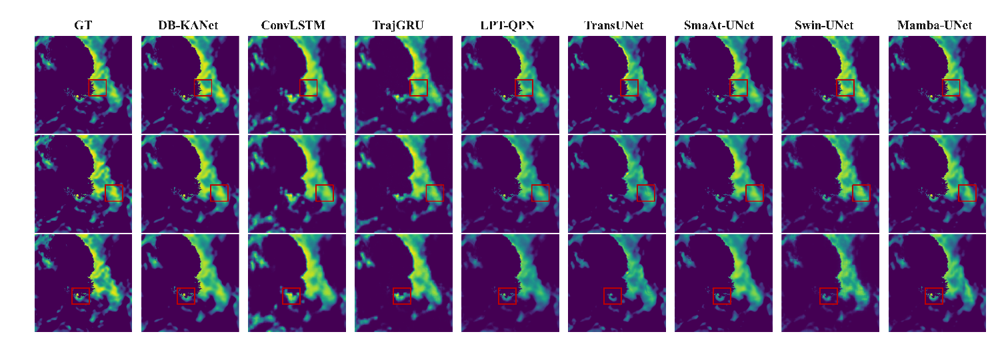
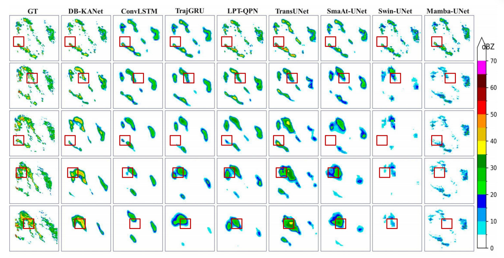

# DB-KANet: A Lightweight Network for Real-Time Precipitation Nowcasting


<p align="center">
  
  
  
  
  
  
</p>

---

## 📖 Introduction

This repository provides the official PyTorch implementation of:

**DB-KANet: A Lightweight Network for Real-Time Precipitation Nowcasting**

Real-time precipitation nowcasting is essential for disaster early warning, urban flood prevention, aviation safety, and operational meteorological services. However, many existing deep learning models rely on complex architectures with high computational cost, which limits their practical deployment on resource-constrained platforms.

To address this problem, we propose **DB-KANet**, a lightweight U-shaped encoder–decoder network for efficient precipitation nowcasting. DB-KANet integrates Kolmogorov–Arnold Network principles into spatiotemporal precipitation prediction and introduces two key modules:

- **Dual-Branch Attention Module (DBAM)** for joint global-context modeling and local rainfall structure extraction.
- **Convolutional Kolmogorov–Arnold Network (CKAN)** for enhancing nonlinear representation capacity in rapidly evolving precipitation fields.

With only **1.32M parameters** and **2.58 GFLOPs**, DB-KANet achieves a favorable balance between prediction accuracy and computational efficiency, making it suitable for real-time nowcasting and edge-deployment scenarios.

---

## ✨ Highlights

- 🌧️ Lightweight network for real-time precipitation nowcasting.
- ⚡ Only **1.32M parameters** and **2.58 GFLOPs**.
- 🧠 Dual-Branch Attention Module for global–local spatiotemporal modeling.
- 🔬 Convolutional KAN block for nonlinear precipitation dynamics.
- 📊 Evaluated on both **LAPS** and **Shanghai radar** datasets.
- 🚀 Designed for operational nowcasting and resource-constrained deployment.

---

## 🧩 Network Architecture

<p align="center">
  
</p>

The overall architecture of DB-KANet follows a U-shaped encoder–decoder design with skip connections. The encoder extracts multi-scale precipitation features, while the decoder restores spatial resolution and generates future precipitation fields.

DBAM and CKAN are embedded into the network to improve spatiotemporal feature representation while maintaining low computational cost.

### 🔹 Dual-Branch Attention Module

DBAM divides feature channels into two specialized branches:

- A **global branch** for long-range dependency modeling.
- A **local branch** for fine-grained spatial structure extraction.

The two branches are fused through lightweight convolution and residual connection, enabling efficient global–local feature interaction.

### 🔹 Convolutional KAN Block

CKAN introduces Kolmogorov–Arnold Network principles into convolutional feature learning. It combines:

- A nonlinear basis-function path for adaptive nonlinear modeling.
- A residual convolutional path for preserving local inductive bias.
- Lightweight fusion for efficient feature transformation.

This design improves the model's ability to represent abrupt and nonlinear precipitation evolution.

---

## 📂 Project Structure

The directory structure is organized as follows:

```text
DB-KANet/
├── assets/
│   ├── architecture.jpg
│   ├── laps_visualization.png
│   └── shanghai_visualization.png
├── configs/
│   └── config_setting.py
├── dataset/
│   ├── Shanghai.py
│   └── metrics.py
├── models/
│   └── DB_KANet.py
├── dataprepare/
├── engine.py
├── train.py
├── utils.py
├── requirements.txt
├── README.md
└── LICENSE
```

Before running the code, please make sure the following files are included:

```text
configs/config_setting.py
dataset/Shanghai.py
dataset/metrics.py
utils.py
```

---

## 🛠️ Environment Setup

### 1. Clone the repository

```bash
git clone https://github.com/WWWH123Q/DB_KANet.git
cd DB_KANet
```

### 2. Create a virtual environment

```bash
conda create -n dbkanet python=3.8
conda activate dbkanet
```

### 3. Install dependencies

```bash
pip install -r requirements.txt
```

The main dependencies include:

```text
torch
torchvision
numpy
h5py
matplotlib
scikit-learn
scikit-image
tqdm
einops
```

If `requirements.txt` is not provided, install the dependencies manually:

```bash
pip install torch torchvision numpy h5py matplotlib scikit-learn scikit-image tqdm einops
```

---

## 📊 Data Preparation

DB-KANet is evaluated on two precipitation nowcasting datasets:

- **LAPS Dataset** for regional-scale precipitation evolution.
- **Shanghai Radar Dataset** for urban-scale precipitation nowcasting.

### 1. LAPS Dataset

The LAPS dataset is used for regional-scale precipitation nowcasting. In our setting, five historical precipitation frames are used to predict the following three future frames.

```text
Input:  5 × 256 × 256
Output: 3 × 256 × 256
```

Recommended data structure:

```text
data/
└── LAPS/
    └── vil_rainy_696.h5
```

The HDF5 file should contain the key:

```text
vil
```

### 2. Shanghai Radar Dataset

The Shanghai radar dataset is used for urban-scale precipitation nowcasting. Each sample contains 25 consecutive frames, where the first five frames are used as input and the following 20 frames are used as prediction targets.

```text
Input:  5 × 256 × 256
Output: 20 × 256 × 256
```

Recommended data structure:

```text
data/
└── Shanghai/
    ├── train/
    ├── val/
    └── test/
```

Please modify the dataset paths in the configuration files according to your local environment.

---

## 🚀 Usage

### 1. Training

To train DB-KANet from scratch, run:

```bash
python train.py
```

Training logs and model checkpoints will be saved to the working directory specified in the configuration file.

The main training settings can be modified in:

```text
configs/config_setting.py
```

Important options include:

```text
batch_size
epochs
learning_rate
optimizer
scheduler
dataset_path
num_classes
input_channels
```

For the LAPS dataset:

```python
num_classes = 3
input_channels = 5
```

For the Shanghai radar dataset:

```python
num_classes = 20
input_channels = 5
```

### 2. Evaluation

The training script performs validation during training and evaluates the best checkpoint on the test set.

The following metrics are used:

- **CSI**: Critical Success Index
- **HSS**: Heidke Skill Score

For the LAPS dataset, normalized thresholds are used:

```text
0.1, 0.3, 0.5, 0.7, 0.8
```

For the Shanghai radar dataset, reflectivity thresholds are used:

```text
20, 30, 35, 40 dBZ
```

---

## ⚙️ Model Complexity

| Model | Params (M) | Model Size (MB) | MACs (G) | FLOPs (G) |
|---|---:|---:|---:|---:|
| ConvLSTM | 12.66 | 55.73 | 23.83 | 47.67 |
| TrajGRU | 12.77 | 48.75 | 26.04 | 52.07 |
| Swin-UNet | 27.17 | 160.09 | 8.71 | 17.42 |
| TransUNet | 105.33 | 401.97 | 32.25 | 64.50 |
| SmaAt-UNet | 4.03 | 15.49 | 9.75 | 19.49 |
| LPT-QPN | 4.62 | 14.14 | 17.56 | 35.12 |
| Mamba-UNet | 19.42 | 78.14 | 9.62 | 19.23 |
| **DB-KANet** | **1.32** | **8.01** | **1.29** | **2.58** |

---

## 📈 Quantitative Results

### LAPS Dataset

| Model | CSI-0.1 | CSI-0.3 | CSI-0.5 | CSI-0.7 | CSI-0.8 | HSS-0.1 | HSS-0.3 | HSS-0.5 | HSS-0.7 | HSS-0.8 |
|---|---:|---:|---:|---:|---:|---:|---:|---:|---:|---:|
| ConvLSTM | 0.7085 | 0.6869 | 0.5557 | 0.2259 | 0.0413 | 0.3940 | 0.3925 | 0.3467 | 0.1797 | 0.0385 |
| TrajGRU | 0.7564 | 0.7150 | 0.6184 | 0.4682 | 0.3453 | 0.4117 | 0.4031 | 0.3726 | 0.3143 | 0.2540 |
| Swin-UNet | 0.7531 | 0.6429 | 0.5394 | 0.4395 | 0.3530 | 0.4128 | 0.3767 | 0.3413 | 0.3016 | 0.2589 |
| TransUNet | 0.7803 | 0.7206 | 0.6016 | 0.4605 | 0.3634 | 0.4212 | 0.4046 | 0.3642 | 0.3088 | 0.2624 |
| SmaAt-UNet | 0.6833 | 0.5788 | 0.4719 | 0.3724 | 0.3035 | 0.3822 | 0.3470 | 0.3083 | 0.2661 | 0.2299 |
| LPT-QPN | 0.8387 | 0.7155 | 0.5154 | 0.2884 | 0.1686 | 0.4430 | 0.4037 | 0.3290 | 0.2185 | 0.1419 |
| Mamba-UNet | 0.8474 | 0.8046 | 0.7008 | 0.5860 | 0.4813 | 0.4465 | 0.4360 | 0.4040 | 0.3655 | 0.3224 |
| **DB-KANet** | **0.8524** | **0.8269** | **0.7433** | **0.5968** | **0.4933** | **0.4482** | **0.4437** | **0.4193** | **0.3691** | **0.3272** |

### Shanghai Dataset

| Model | CSI-20 | CSI-30 | CSI-35 | CSI-40 | HSS-20 | HSS-30 | HSS-35 | HSS-40 |
|---|---:|---:|---:|---:|---:|---:|---:|---:|
| ConvLSTM | 0.5485 | 0.4592 | 0.3825 | 0.2610 | 0.6822 | 0.6162 | 0.5454 | 0.4091 |
| TrajGRU | 0.5649 | 0.4902 | 0.4211 | 0.3011 | 0.6938 | 0.6409 | 0.5823 | 0.4578 |
| LPT-QPN | 0.5732 | 0.4815 | 0.3945 | 0.2828 | 0.7020 | 0.6331 | 0.5545 | 0.4346 |
| TransUNet | 0.4941 | 0.3390 | 0.2225 | 0.1013 | 0.6305 | 0.4876 | 0.3526 | 0.1791 |
| SmaAt-UNet | 0.5160 | 0.4246 | 0.3651 | 0.2759 | 0.6522 | 0.5799 | 0.5246 | 0.4268 |
| Swin-UNet | 0.4149 | 0.2548 | 0.1675 | 0.0799 | 0.5532 | 0.3901 | 0.2789 | 0.1452 |
| Mamba-UNet | 0.5651 | 0.4856 | **0.4281** | **0.3345** | 0.6974 | 0.6375 | 0.5894 | 0.4762 |
| **DB-KANet** | **0.5762** | **0.4931** | 0.4263 | 0.3293 | **0.7792** | **0.6944** | **0.6722** | **0.6300** |

---

## 🖼️ Qualitative Results

### LAPS Dataset

<p align="center">
  
</p>

The visualization results on the LAPS dataset show that DB-KANet preserves precipitation structures more effectively than competing methods, especially under moderate and high-intensity rainfall conditions.

### Shanghai Radar Dataset

<p align="center">
  
</p>

The visualization results on the Shanghai radar dataset show that DB-KANet better suppresses false precipitation activations in non-precipitation regions while maintaining the structure of severe precipitation echoes.

---

## 🔍 Quick Test

You can test the model with a random input tensor:

```python
import torch
from models.DB_KANet import DB_KANet

model = DB_KANet(
    num_classes=3,
    input_channels=5
)

x = torch.randn(1, 5, 256, 256)
y = model(x)

print(y.shape)
```

Expected output for the LAPS setting:

```text
torch.Size([1, 3, 256, 256])
```

For the Shanghai setting, set `num_classes=20`, and the expected output is:

```text
torch.Size([1, 20, 256, 256])
```

---

## 📦 Pretrained Models

Pretrained models will be released after paper acceptance.

The recommended checkpoint structure is:

```text
checkpoints/
├── dbkanet_laps.pth
└── dbkanet_shanghai.pth
```

After downloading the pretrained weights, place them under the `checkpoints/` directory.

---

## 📝 Citation

If you find this repository useful for your research, please cite our paper:

```bibtex
@article{wang2025dbkanet,
  title={DB-KANet: A Lightweight Network for Real-Time Precipitation Nowcasting},
  author={Wang, Sihan and Huang, Xiaohui and Yang, Xiaofei and Ban, Yifang and Wang, Fu},
  journal={},
  year={2025}
}
```

The BibTeX entry will be updated after publication.

---

## 🙏 Acknowledgements

Thanks to the authors of DB-KANet for their open-source contribution.
We also acknowledge the open-source implementations of comparison methods used in this study

---

## 📮 Contact

For questions about the paper or code, please contact:

```text
Sihan Wang
East China Jiaotong University
Email: 827815700@qq.com
```


---

## 📄 License

This repository is released for academic research purposes.

Please refer to the `LICENSE` file for more details.
